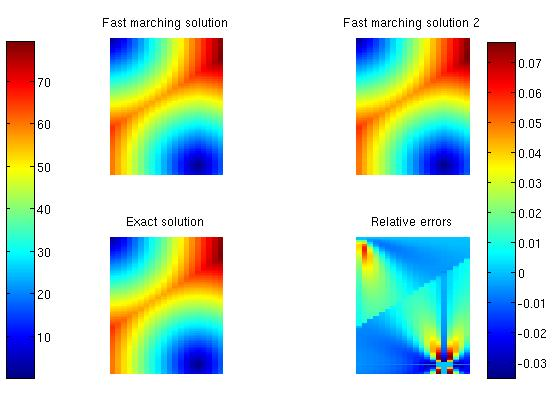
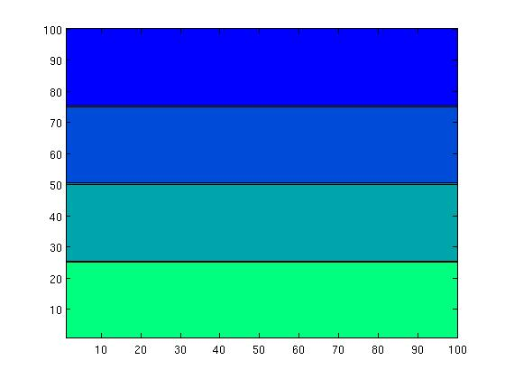
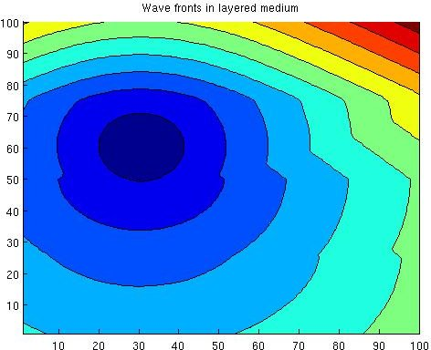
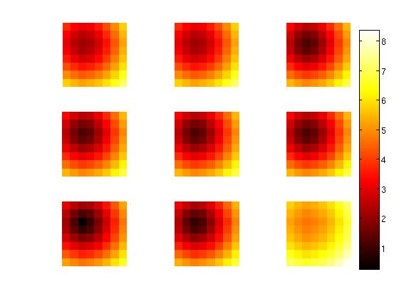
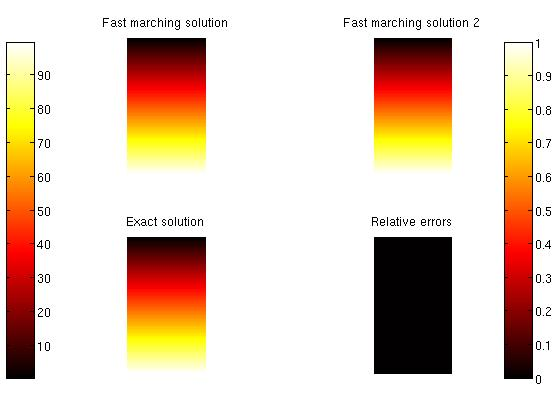
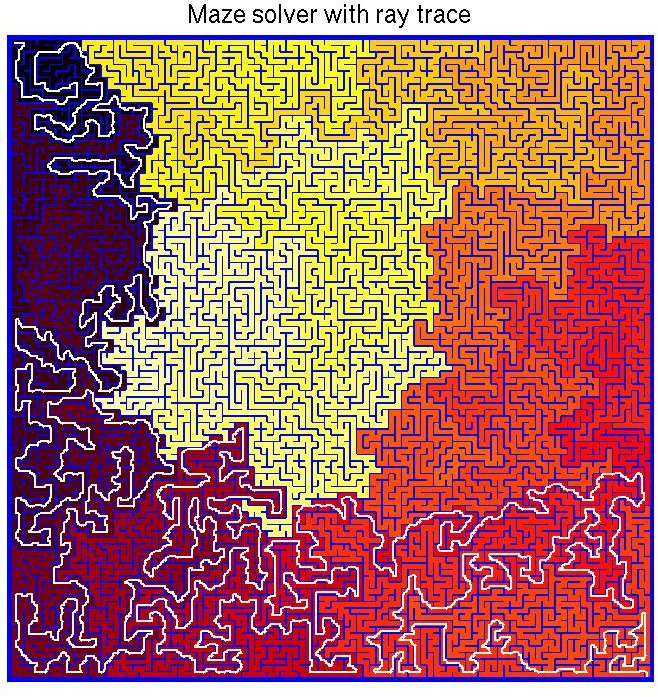
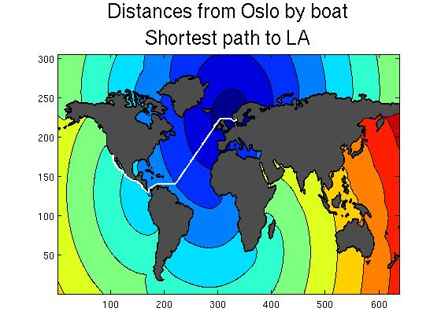
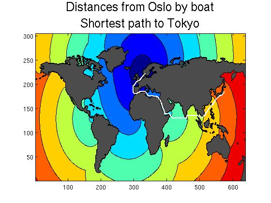
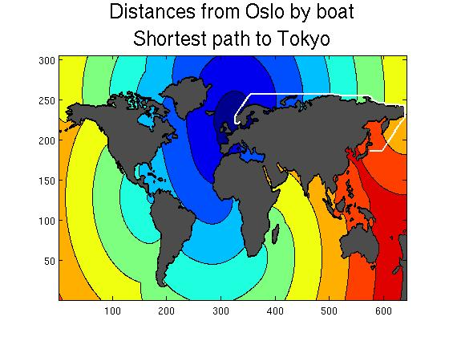
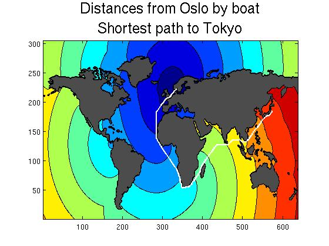

## The fast marching (FM) method
FM calculates first arrival time of a seismic wave travelling through various geological layers. The results serve as a kind of preview and comparison to the results obtained by the more comprehensive full-wave model. I implemented this to help out my dad at his work in the spring of 2011. The existing implementation on [file exchange](http://www.mathworks.com/matlabcentral/fileexchange/24531-accurate-fast-marching) only allowed for grids where the space between nodes is the same in all dimensions. This is clearly impractical if, for example, you want to model a geography that is complex in the horizontal plane but uniform in the vertical dimension. Supporting this feature was the main reason for this project.

  

The [Fast marching method](http://en.wikipedia.org/wiki/Fast_marching_method) is a very rapid method for solving the [Eikonal equation](http://en.wikipedia.org/wiki/Eikonal_equation), which describes the advances of a wave*front*. However it's applicable to a great variety of problems (see for example the [webpage](http://math.berkeley.edu/~sethian/2006/Applications/Menu_Expanded_Applications.html) of J.A. Sethian, one of the original developers). Some applications are shown by the output of my program below. 
The method is very interesting, containing elements from areas such as level-set methods for surface tracking, Dijikstra's method for optimal network path solutions, finite difference schemes and upwind causality conditions, and tree-sorting algorithms.

  

This implementation exist both in Matlab and C++ with a Matlab wrapper supplied (with the mex libraries) allowing for flexible, high-level input and data treatment. The C++ implementation is on the order of 100 times faster.

  

Both 1st order and 2nd order finite difference schemes are available, and warning messages are displayed when the method has to revert to the 1st order scheme, which is more stable than the second order scheme. This is in contrast to [the implementation](http://www.mathworks.com/matlabcentral/fileexchange/24531-accurate-fast-marching) that is already on the file exchange, which offers more accurate schemes but less stable treatment of extreme cases and no warning messages.


## Installation
Just download. Test with one of the `TS_` scripts. Output is described below.

Note: The C++ code uses infinity as a number to avoid use of boolean switches. This works on the GNU compiler, but I don't think it ports to all compilers. Alternatively, just stick to the Matlab implementations.

  

## Examples

The cooler output plots are further below.  
  

If you drop a stone into the water, rings representing wavefronts propagate outwards from the "epicenter", or source point, where you dropped the stone. The medium (water) being uniform, the wave propagates with the same constant speed in all directions, creating *circular* rings. I.e. in this simple case, an exact analytic solution is known. The time, T(r), taken to travel to any point a distance, r, from the center, is equal to r/F, where F represents the speed of the wave in water. If you drop two stones, you get two source points. The plots of T below illustrate this scenario. The upper two solutions were produced with 1st and 2nd order fast marching methods. The bottom left solution is the analytic one. The bottom right plot shows the relative error between the fast marching solution of order 2 and the analytic solution.



##### Strata

Here's the sort of thing my dad might use this for. Let's say the earth below us consists of 4 distinct layers, each with its own propagation speed, F(x,z), illustrated below.




This time, the wavefronts will not produce circular rings, or analytic solutions that are easy to find. However, the fast marching method is not deterred. All it needs is a specification of the speed map F(x,z) and it will give you T(x,z).



##### 3D

What if we're in a 3D domain? The fast marching method is easily generalized, requiring only some adaptation of the finite difference scheme and the data storage. The plot below shows 9 cross sections (i.e. z=constant) of T(x,y,z).



##### Special cases

The implementation is flexible enough to handle trivial/exceptional cases. For example, here is the output from running the 3D fast marching method on a domain with two singleton dimensions (i.e. where two of the dimensions only contain one discretization step).



##### Wall

This example illustrates that one can insert impenetrable "walls" in the domain, where the speed of the wave is defined to be zero. This is in many ways an exceptional case, as it may result in division by zero or zero*inf computations, and so it requires special attention. Also, the speed map has been bombarded with random noise, creating the noisy look of the plot.


##### Maze

Now we're getting to the cool parts. Did you know the method can be used to solve labyrinths? Here's how. Make a speed map F(x,y) where F=0 wherever there's a wall and F=1 elsewhere. Put the source point at the end (exit) of the labyrinth, and run the fast marching method. Then the wavefront will propagate through the labyrinth, including cul-de-sacs, and produce a map of T(x,y) as a result again. This tells you how long it takes to reach any point in the labyrinth from the exit, and is shown by the color in the maze below.

  

Looking at the maze, it seems like there are different regions with discontinuous color transitions. In fact, there's always a continuous path from one point to any other, but not across a singularity (the walls)!

  

How do you find the path through the labyrinth from the color map? The white line on the figure below? It's called ray tracing, or path tracing. You start at the beginning (entry), and look around you. In which direction does T(x,y) decrease the most? (Approximate the gradient or just search for the neighbor pixel with the lowest value for T). Take a step in that direction. Repeat the process until you get to the source point, marked by T=0. (Depending on your initial source point configuration, maybe there is no such node exactly, and so maybe you want to include additional end point criteria).

  

Cooler yet, the very same method can be used to figure out the best way to, say, move your bed through the maze that is your house! All you need is to make a 3D speed map model of the house, and set F=0 wherever there's a wall. However, since the bed is not a point, but an object with a finite size, you might want to add some complexity -- increasing the dimensionality of your model to 5D. The two new dimensions will be used to specify the orientation of the bed (elevation and azimuth). Now the speed map is a function of five variables: F(x,y,z,θ,ϕ). So, say you're in a narrow hallway. Then F=1 for most values of θ and  ϕ, except when the bed would crash with the walls, in which case F=0. Also, you might want to slow down (by lowering F) when you're in a tight spot, to reflect the fact that progress will be slower. In the end, you run a ray tracer backwards, which will give you the fastest/optimal way of moving the bed out of the apartment.



##### World map

How about getting from A to B as fast as possible? Same principle. Propagate a wave front from a source point, taking into account different propagation speeds.

  

Unless you're James Bond, the speed of your boat will be around 20 knot on the ocean, and zero on land. Now get (google) a map of the world. Process it to make a speed map out of it. Feed this to the fast marching method, with a given source point, and it will output a map of T. In the figure below, the source point is Oslo, Norway.

  

Starting the ray tracer from, say, LA, will lead you back to Oslo through the white path -- the shortest path.



Same time-distance map T, different starting point for the ray tracer.



This time, let's open up the Bering strait, and close the Suez canal. I.e. set the speed map pixels in those regions to F=0 and F=1. Run the fast marching method again. Then the ray tracer from Tokyo. This time we see that it's shorter to go north of Russia than south of Africa, though you might get slightly cold on the way. Note that I'm not sure what kind of [world map projection](http://en.wikipedia.org/wiki/Map_projection) this is, but it probably distorts global distances.



What if we close the Bering strait and the Suez canal? Then we gotta go by the Cape of Good Hope, like the spice traders of yore.



These are some of the possible applications of the fast marching method. There are of course infinitely (countably?) more.

##### Referencing 

[](https://doi.org/10.5281/zenodo.2025811)

If you use this software in a publication, please cite as follows.

```bibtex
@misc{raanes2011fm,
	author = {Patrick N. Raanes},
	title  = {patricknraanes/FM: Version 1.0},
	month  = may,
	year   = 2011,
	doi    = {10.5281/zenodo.2025811},
	url    = {https://doi.org/10.5281/zenodo.2025811}
}
```

